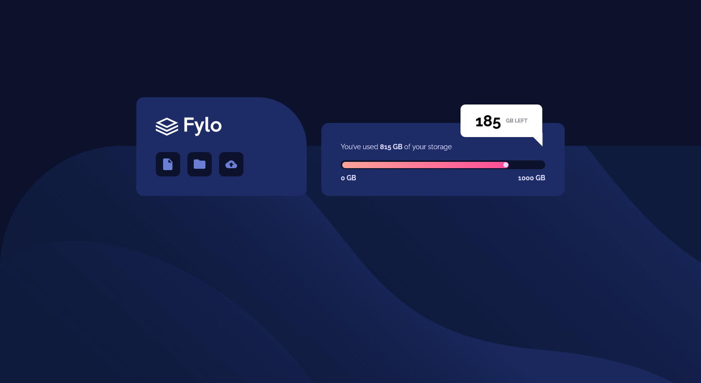

# Frontend Mentor - Fylo data storage component solution

This is a solution to the [Fylo data storage component challenge on Frontend Mentor](https://www.frontendmentor.io/challenges/fylo-data-storage-component-1dZPRbV5n).

## Table of contents

- [Overview](#overview)
  - [The challenge](#the-challenge)
  - [Screenshot](#screenshot)
  - [Links](#links)
- [My process](#my-process)
  - [Built with](#built-with)
  - [What I learned](#what-i-learned)
  - [Continued development](#continued-development)
  - [Useful resources](#useful-resources)
- [Author](#author)
- [Acknowledgments](#acknowledgments)

## Overview

### The challenge

Users should be able to:

- View the optimal layout for the site depending on their device's screen size

### Screenshot




### Links

- Solution URL: [FrontendMentor.io](https://www.frontendmentor.io/solutions/page-with-html-and-css-KZqmYzwL1)
- Live Site URL: [Vercel](https://prj-08-fylo-data-storage-component.vercel.app/)

## My process

### Built with

- Semantic HTML5 markup
- CSS custom properties
- Flexbox
- CSS Grid
- Mobile-first workflow
- Geometric figures with CSS

### What I learned

How to make a triangle with CSS:
```html
<div class="arrow-up"></div>
```
```css
.arrow-up {
    position: absolute;
    width: 0; 
    height: 0; 
    border-left: 20px solid transparent;
    border-right: 20px solid transparent;
    border-bottom: 20px solid white;
    transform: rotate(45deg);
    bottom: -8px;
    right: -13px;
  }
```
### Continued development

Next projects to use Vite and Tailwindcss.

### Useful resources

- [CSS Triangle](https://css-tricks.com/snippets/css/css-triangle/) - The idea is a box with zero width and height. The actual width and height of the arrow is determined by the width of the border. In an up arrow, for example, the bottom border is colored while the left and right are transparent, which forms the triangle.

## Author

- Website - [Gustavo Sanchez](https://www.gusanche.dev)
- Frontend Mentor - [@gusanchedev](https://www.frontendmentor.io/profile/gusanchedev)
- Github - [@gusanchedev](https://www.github.com/gusanchedev)
- Twitter - [@gusanchedev](https://www.twitter.com/gusanchedev)
- Linkedin - [gusanchedev](https://www.linkedin.com/in/gusanchedev/)

## Acknowledgments

Thanks to Mariapaz for being my friend and support 💙
